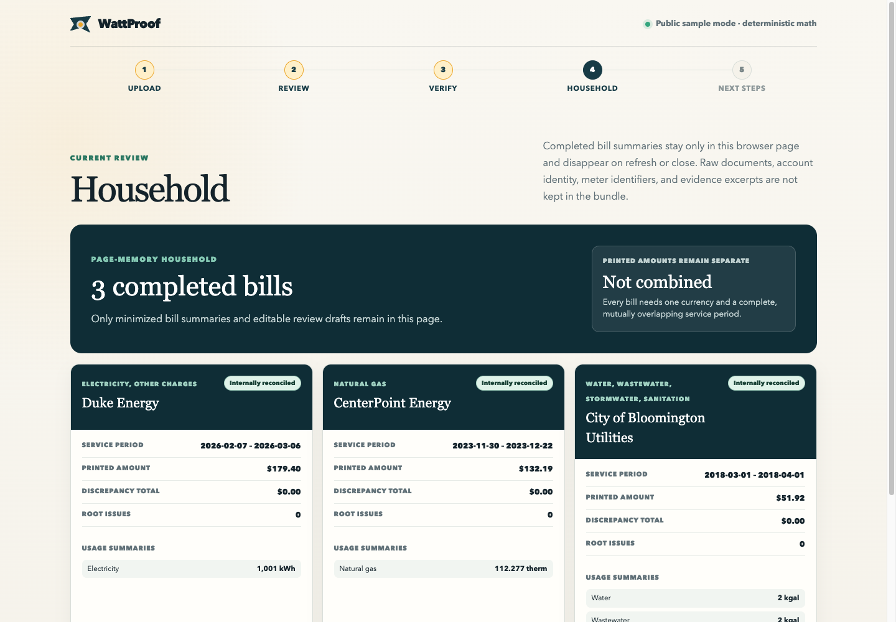

# WattProof

[](https://github.com/3clyp50/WattProof/actions/workflows/verify.yml)

**Live demo:** [wattproof.tech](https://wattproof.tech). All five public sample paths
are deterministic and need no sign-in. For a personal PDF, **Continue with Codex**
opens OpenAI's official device sign-in; WattProof never asks for an API key or
password in the browser.

WattProof is an evidence-first residential utility-bill checker. It reads visible
statement evidence, reproduces printed arithmetic with deterministic `Decimal` code,
and applies published tariffs only when an exact, period-bound adapter matches.

The core is provider-neutral: one document can contain electricity, natural gas,
water, wastewater, stormwater, sanitation, or other service sections. The current
public fixtures happen to include California and Indiana documents; Indiana is test
coverage, not a product boundary. Exact tariff coverage is much narrower than document
coverage and is never inferred from a provider family name.



## What WattProof proves

Verification is cumulative and the UI displays the highest completed level:

1. **Evidence extracted** — every material fact has visible rendered-page support.
2. **Internally reconciled** — deterministic rules reproduce meter, conversion, rate,
   tax, subtotal, and total relationships where every operand is printed or is an
   explicitly labeled inferred fact with rendered-page evidence.
3. **Tariff verified** — an exact adapter independently matches applicable published
   rates for the provider, jurisdiction, schedule, and service period.

Internal reconciliation is not tariff verification. A rate printed on a bill can
support a product check, but it is not an independent source for itself. Unsupported
tariff coverage is reported as a limitation and does not prevent useful internal
checks.

**Domain specification:** [Chadwick Jones (`@TerminallyLazy`)](https://devpost.com/TerminallyLazy) contributed the U.S. electricity-billing research and practical interpretation that shaped WattProof's charge model, support boundary, and review language.

When several independent discrepancies explain the same downstream tax, subtotal,
current-charge, or amount-due symptom, the ledger keeps the complete ordered root set.
Dependent symptoms remain visible with a `Derived from roots` trace, but only the
independent roots contribute to the discrepancy total, priority findings, household
issue count, and provider-request grounding. The legacy `root_cause_id` field remains
populated when there is exactly one root; `root_cause_ids` carries one or many roots.

The top-level level is cumulative but does not claim that every charge is
tariff-backed. Each ledger line carries its own scope. In the PG&E/3CE fixture, the
two 3CE utility-users-tax lines are checked only as **Printed math** from the
statement's rate and base amounts; no archived source establishes that 1% as the
governing tariff.

Only the exact PG&E delivery + Central Coast Community Energy (`3Cchoice`) E-TOU-C
2022 fixture currently reaches **Tariff verified**. Adapter selection is fail-closed
on provider identity, jurisdiction, schedule, service dates, required facts, and
hash-verified archived sources. There is no Duke tariff adapter and no nationwide
tariff database or coverage claim.

The labeled synthetic PG&E fixture changes one peak charge from `$36.44` to `$41.44`.
It exists only as a regression case: WattProof identifies one root `$5.00` discrepancy
without presenting it as a real bill.

## Rendered evidence is authoritative

WattProof validates each PDF's signature and size. An exact known hash routes to a
locally reviewed fixture; every page of an unknown accepted PDF is then preflighted and
rendered before visual extraction. Rendered pixels are the authoritative document
surface. Embedded PDF text is only a separately labeled
`UNTRUSTED_NATIVE_TEXT_HINT`; a native-only value cannot become a fact.

The public samples deliberately exercise failure modes that text-only extraction
misses:

- **Duke Energy Indiana electricity:** the official guide contains a complete but
  explicitly illustrative statement. Its `1001 kWh`, tiers, riders, `$167.66` current
  charges, `$11.74` tax, and `$179.40` total reconcile internally. They are not Duke
  tariff truth.
- **CenterPoint Energy Indiana gas:** the rendered statement shows `108 CCF × 1.03960
  = 112.277 therms` and `$132.19`. Its native text layer also contains an invisible,
  conflicting `$134.69` combined example. WattProof excludes that native-only example,
  including its `534 kWh` and `6.326 therm` values. Review visibly warns that rendered
  evidence took precedence without importing the hidden values.
- **City of Bloomington water:** the explanatory wrapper has native text, while the
  actual statement is a raster image. Rendering exposes the water, wastewater,
  stormwater, sanitation, and `$51.92` total that a native-text threshold would miss.

Known public documents are recognized by exact SHA-256 and use deterministic local
structured fixtures. This path is keyless and does not require the third-party PDFs to
be committed. See [GROUND_TRUTH.md](GROUND_TRUTH.md) for URLs, hashes, visible values,
exclusions, and period-specific limitations.

## Quick start

Requirements:

- Python 3.12 or newer
- Poppler command-line tools: `pdfinfo`, `pdftotext`, and `pdftoppm`
- Optional for personal PDFs: the Codex CLI and a Codex-enabled ChatGPT account
- Node.js and Chrome/Chromium/Edge only for the opt-in real-browser test

On Ubuntu or Debian, install Poppler with:

```bash
sudo apt-get update
sudo apt-get install poppler-utils
```

Create the environment and run the app:

```bash
python3 -m venv .venv
source .venv/bin/activate
python -m pip install -r requirements-dev.txt
make run
```

Open [http://127.0.0.1:8000](http://127.0.0.1:8000). The five built-in controls run
without an API key or network access. The browser flow is **Upload → Review → Verify →
Household → Next steps**.

After a result, **Add another bill** returns to Upload while retaining a minimized
summary. The household bundle is JavaScript page memory only. It excludes raw files,
page images, evidence excerpts, customer names, addresses, account numbers, and meter
IDs; provider display names remain so each summary can be identified. Refresh, close,
**Clear household**, or **Start over** removes it. Provider review drafts remain
separate and WattProof never sends them.

## Personal PDFs with Continue with Codex

Install the same Codex release pinned by the production image:

```bash
npm install --global @openai/codex@0.145.0
```

Choose **Continue with Codex**. WattProof requests a one-time device code and sends the
visitor to the official `auth.openai.com` page. The browser receives connection status,
not a password or token. A connected GPT-5.6 Luna session maps ordered rendered page
images into strict provider-neutral schema 2.0 output. Native PDF text is supplied only
as an explicitly untrusted locator hint; there is no native-text-only fallback.

Codex runs in an isolated, temporary server-side session with an ephemeral extraction
thread and no tool or network authority. Pending codes expire after 10 minutes;
connected idle sessions expire after 30 minutes. Disconnect or expiry closes the
process and removes its private temporary directory. The model maps evidence only;
trusted `Decimal` code still performs every calculation.

## Optional operator visual fallback

An operator may separately configure the Responses API visual reader:

```bash
read -rsp "OpenAI API key: " OPENAI_API_KEY && printf '\n'
export OPENAI_API_KEY
export OPENAI_MODEL="gpt-5.6"
make run
```

The configured path sends rendered page images first and the labeled native-text hint
last to GPT-5.6. The Responses API call uses strict `UtilityDocument` structured output
and `store=False`. The model maps visible evidence into typed fields; it does not
calculate, repair facts, invent operands, or supply tariff rates. Trusted local code
replaces document metadata and performs every calculation.

Without a connected Codex session or configured operator reader, an unknown bill gets
a controlled sign-in-required or extraction-unavailable response.

## CLI proof

All five built-in samples use the same audit service as the web app:

```bash
python -m wattproof --sample authentic
python -m wattproof --sample synthetic
python -m wattproof --sample duke
python -m wattproof --sample centerpoint
python -m wattproof --sample bloomington
```

Expected highest levels:

| Sample | Highest level | Important boundary |
| --- | --- | --- |
| `authentic` | Tariff verified | Exact 2022 PG&E/3CE adapter |
| `synthetic` | Tariff verified with one `$5.00` discrepancy | Clearly labeled regression fixture |
| `duke` | Internally reconciled | Illustrative guide; no Duke tariff claim |
| `centerpoint` | Internally reconciled | Visible gas statement only |
| `bloomington` | Internally reconciled | Raster statement rendered into evidence |

Use `--json` for the complete typed result. A PDF can be supplied with:

```bash
python -m wattproof --file path/to/bill.pdf
```

## Optional official sample download

Third-party PDFs are not tracked. To fetch the three official guides into ignored
`tmp/public-samples/` and verify their exact SHA-256 values:

```bash
scripts/fetch-public-samples.sh
```

The script supports `sha256sum` on Linux and `shasum -a 256` on macOS. It reuses an
existing file only after verification, downloads through a temporary file, cleans
partials, and refuses to replace a mismatched existing file.

## Tests and browser verification

Run the complete local gate:

```bash
make verify
```

This runs pytest, Ruff, strict MyPy with the Pydantic plugin, and bytecode compilation.
The suite covers schema validation, rendered-page extraction bounds, native-text
conflicts, deterministic fixtures, exact adapter matching, reconciliation, privacy,
the Codex device-login/session lifecycle, async browser state, hostile markup, and the
five-step web contract.

Run the actual Chromium smoke test explicitly:

```bash
WATTPROOF_REAL_BROWSER=1 \
  .venv/bin/python -m pytest \
  tests/test_multi_utility_web.py::test_real_chromium_sample_review_and_audit_flows -q
```

If automatic discovery cannot find a browser, set `AGENT_BROWSER_BIN` to a Chrome,
Chromium, or Edge executable. The smoke test exercises all five samples, the sequential
Duke → CenterPoint → Bloomington household flow, mobile layouts, refresh clearing,
preview cleanup, inert rendering, and absence of external browser requests.

The committed desktop and mobile evidence is documented in
[docs/screenshots/README.md](docs/screenshots/README.md).

## Architecture and support boundary

One Flask process serves a framework-free browser UI and JSON endpoints. There is no
database, account system, queue, provider login, payment path, automatic sending, or
persistent household profile.

```text
PDF → preflight → render every page → provider-neutral evidence review
    → deterministic internal reconciliation
    → exact tariff adapter when and only when it matches
    → result → privacy-minimized page-memory household bundle
```

Important modules:

- `wattproof/extract.py` owns bounded PDF inspection, rendering, known-hash routing,
  and the GPT-5.6 visual extraction contract.
- `wattproof/codex.py` owns official device login, isolated App Server sessions,
  strict schema 2.0 output, resource limits, and automatic cleanup.
- `wattproof/utility_models.py` defines the provider-neutral schema and audit result.
- `wattproof/reconcile.py` performs generic `Decimal` statement checks.
- `wattproof/adapters.py` contains the exact PG&E/3CE tariff adapter registry.
- `wattproof/audit_service.py` routes both legacy and provider-neutral documents.
- `wattproof/app.py` serves request handlers and the temporary Codex session lifecycle;
  `wattproof/static/app.js` owns the current-page household state.

The full rationale and trust boundaries are in [ARCHITECTURE.md](ARCHITECTURE.md).

## PG&E/3CE ground-truth continuity

The authentic public fixture is the December 2022 PG&E/3CE statement because it forms
a coherent bill-and-rate pair with archived period-matched sources. A supplied March
2026 pricing summary cannot be applied backward to that bill. WattProof verifies the
supported PG&E and 3CE rates, printed subtotals, current charges, and amount due while
leaving unsourced lines and alternative-plan savings as explicit `cannot_verify`
results.

That narrow historical adapter is a strength, not a template for guessing newer or
unrelated tariffs. Read [GROUND_TRUTH.md](GROUND_TRUTH.md) before changing a rate,
effective period, source hash, or support claim.

## Privacy and safety

- Only public anonymized, public illustrative, or clearly synthetic fixture data is
  tracked and shown in screenshots.
- Uploaded bytes live in a temporary file and are deleted when extraction ends.
- Raw documents, rendered pages, account identity, and model inputs are not persisted
  by WattProof.
- Codex sign-in happens only on OpenAI's official page. Passwords and tokens never
  enter the WattProof page or browser storage; server-side session files are temporary
  and removed on disconnect or expiry.
- Unknown documents reach GPT-5.6 only through a visitor-connected Codex session or an
  operator-configured Responses reader. The Responses fallback uses `store=False`.
- Review requests require user review, remain editable in page memory, and are never
  sent automatically.
- WattProof asks for clarification or correction; it does not accuse a provider,
  provide legal advice, or guarantee savings.

## Project documents

- [PLAN.md](PLAN.md) — product thesis, reliability rules, and demo narrative
- [GROUND_TRUTH.md](GROUND_TRUTH.md) — exact fixture provenance and hand calculations
- [ARCHITECTURE.md](ARCHITECTURE.md) — processing, trust, adapter, and privacy boundaries
- [docs/screenshots/README.md](docs/screenshots/README.md) — reproducible real-app captures
- [CODEX_LOG.md](CODEX_LOG.md) — primary-session engineering evidence
- [SUBMISSION.md](SUBMISSION.md) — submission copy and timed demo script

Licensed under the [MIT License](LICENSE).
