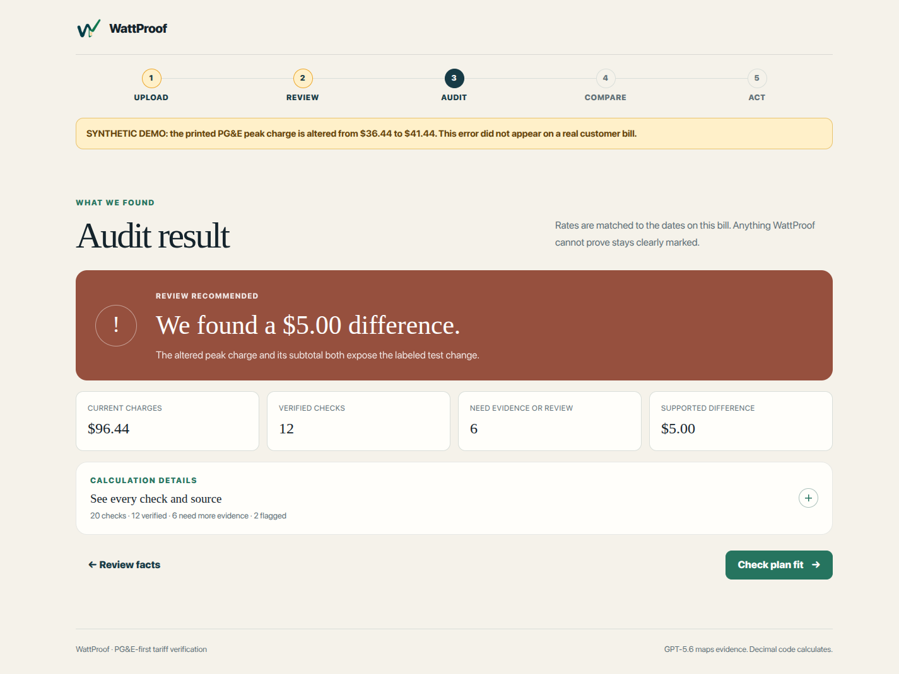

# WattProof

[](https://github.com/3clyp50/WattProof/actions/workflows/verify.yml)

**WattProof checks the math on household electricity bills.** A user uploads a bill, reviews every material fact with page evidence, and gets a deterministic line-by-line audit against the published tariff that actually governed the billing period.

> GPT-5.6 maps document evidence. Typed Decimal code calculates.



WattProof is an OpenAI Build Week project for the **Apps for Your Life** track. Its first polished adapter is intentionally narrow: one public anonymized PG&E delivery + Central Coast Community Energy generation statement, one exact schedule and effective period, audited exceptionally well.

## The judged vertical slice

1. **Upload** a native PDF or start instantly with the bundled public sample.
2. **Review** extracted facts, printed-versus-inferred status, confidence, page, and quoted evidence.
3. **Audit** supported charges with exact rates, formulas, inputs, snapshot hashes, and explicit rounding.
4. **Compare** plans only when the data can support it; otherwise explain exactly what interval data is missing.
5. **Act** with an editable, neutral bill-review request whose claims map back to audit lines.

The authentic sample reconciles. A separate structured fixture is visibly labeled synthetic and changes one peak charge from `$36.44` to `$41.44`; WattProof detects exactly `$5.00` and never suggests that this occurred on a real bill.

## Why this matters

A nationally representative [Consumer Reports survey](https://advocacy.consumerreports.org/press_release/new-survey-from-consumer-reports-finds-majority-of-households-strained-by-energy-bills-concerned-over-data-centerss-impact-on-bills/) of 2,146 U.S. adults found that **68%** said home energy costs strained their household finances to some degree. [PG&E says](https://www.pge.com/en/about/company-information/company-profile.html) its gas and electric service reaches approximately **16 million people**.

Dedicated utility-bill auditing exists, but products such as [EnergyCAP](https://www.energycap.com/utility-bill-energy-management-software/features/utility-bill-auditing-software/) and [ENGIE Impact](https://www.engieimpact.com/capabilities/utility-bill-audit-services) frame it as organizational software or services. WattProof's bet is that households deserve the same line-by-line discipline in a consumer-readable flow. The MVP begins with one exact schedule because a narrow result that can be proven is more useful than nationwide coverage that merely looks plausible.

## Quick start

Requirements:

- Python 3.12 or newer
- Poppler command-line tools (`pdftotext` and `pdfinfo`)

On Ubuntu/Debian, install the system PDF tools if they are missing:

```bash
sudo apt-get update
sudo apt-get install poppler-utils
```

Create the environment and run the app:

```bash
python3 -m venv .venv
source .venv/bin/activate
python -m pip install -r requirements.txt
make run
```

Open [http://127.0.0.1:8000](http://127.0.0.1:8000). Click **Audit authentic sample**; no API key or network access is required for the complete demo path.

To use a different native PG&E/3CE PDF, optionally configure GPT-5.6:

```bash
read -rsp "OpenAI API key: " OPENAI_API_KEY && printf '\n'
export OPENAI_API_KEY
export OPENAI_MODEL="gpt-5.6"
make run
```

WattProof sends unknown native-PDF text to the OpenAI Responses API with strict Pydantic output and `store=False`. The bundled known fixture is recognized by SHA-256 and stays entirely local.

## CLI proof

The same engine runs headlessly:

```bash
python3 -m wattproof --sample authentic
python3 -m wattproof --sample synthetic
python3 -m wattproof --sample authentic --json
python3 -m wattproof --file assets/pge-anonymous-3ce-sample-bill.pdf
```

Expected verdicts:

```text
Reconciled where the archived sources support a calculation
Possible $5.00 source-supported discrepancy
```

## Tests and release checks

```bash
python -m pip install -r requirements-dev.txt
make verify
```

`make verify` runs pytest, Ruff, strict MyPy with the Pydantic plugin, and Python bytecode compilation. The same gate runs publicly on Python 3.12 and 3.13 through GitHub Actions. The regression suite covers:

- golden PDF extraction and hand-checked audit output;
- the GPT-5.6 strict-schema contract, `store=False`, and trusted document metadata;
- tariff snapshot hash integrity and effective-period boundaries;
- Decimal half-up rounding;
- the exact `$5.00` synthetic discrepancy without double-counting its subtotal symptom;
- missing interval data, unsupported providers, malformed files, and rejected misleading samples;
- letter claim grounding and required user review;
- Flask upload, review-validation, audit, and five-step page contracts.

A real Chromium pass also covers the authentic sample, actual PDF upload, synthetic discrepancy, rejection state, mobile layout, plan insufficiency, action letter, and copy control. Rendered evidence is under `output/playwright/`.

## Exact support boundary

| Capability | MVP support |
| --- | --- |
| Delivery utility | PG&E residential electricity |
| Generation provider | Central Coast Community Energy (`3Cchoice`) |
| Schedule | E-TOU-C / 4-9 p.m. every day |
| Auditable period | 2022-11-08 through 2022-12-08 |
| Native PDF | Yes; 10 MB and 20-page limits |
| Known public sample | Fully local and deterministic |
| Other native bills | GPT-5.6 extraction when configured; audit only if the exact adapter supports them |
| Scanned PDFs / OCR | Not in the MVP |
| Plan savings | Refused for this fixture because its aggregate buckets cannot reconstruct other hour windows |

WattProof deterministically verifies the printed PG&E peak, off-peak, baseline credit, franchise fee, 3CE peak/off-peak generation, and printed 3CE utility-tax lines. It also verifies section subtotals, current charges, and amount due.

It does **not** force a match for the generation credit, PCIA, Energy Commission tax, PG&E utility tax, or meter delta when the exact source or printed readings are absent. Those lines remain `cannot_verify` with a reason.

See [`GROUND_TRUTH.md`](GROUND_TRUTH.md) for the hand calculations and [`sources/provenance.json`](sources/provenance.json) for immutable source metadata.

## Why the authentic fixture is from 2022

The supplied PG&E pricing summary is effective March 1, 2026, but the supplied consolidated-bill PDF is only a layout explainer with placeholder dates and no charge detail. A three-query current-source sweep on July 19, 2026 found newer guidance but no newer official, complete ordinary residential statement with matching auditable sources.

The December 2022 public PG&E/3CE statement is therefore the newest coherent bill-and-rate pair found. Applying a 2026 rate to a 2022 statement would make the demo newer and wrong. WattProof chooses effective-period truth.

## Architecture

One Flask process serves a framework-free browser UI and three small JSON endpoints. The browser holds the reviewed extraction; the server keeps no bill database or account state.

```text
native PDF → hash/native text → strict BillExtraction → user review
    → hash-verified tariff snapshots → Decimal audit → grounded request
```

- `wattproof/extract.py` validates PDFs, recognizes the golden sample, extracts native text, and invokes GPT-5.6 only when needed.
- `wattproof/models.py` preserves typed facts, confidence, printed/inferred status, page, and source quote.
- `wattproof/tariffs.py` refuses to calculate if an archived source hash changes.
- `wattproof/audit.py` owns all arithmetic, reconciliation, insufficiency, and grounded request facts.
- `wattproof/app.py` owns the stateless Flask routes.
- `fixtures/` contains authentic expected data and the clearly labeled synthetic alteration.

The smallest-architecture rationale is in [`ARCHITECTURE.md`](ARCHITECTURE.md).

## Privacy and safety

- Only public anonymized or clearly synthetic sample data is tracked.
- Uploaded bytes live in a temporary file for extraction and are deleted when that request ends.
- The app has no accounts, database, background jobs, provider login, payment path, or automatic sending.
- Unknown native PDFs reach OpenAI only when the operator supplies a key; API response storage is disabled.
- The request screen always states that user review is required.
- WattProof asks for clarification or correction; it does not accuse a provider, offer legal advice, or guarantee savings.

## Codex and GPT-5.6

Codex was used in one primary build session to inspect and render PDFs, reject misleading fixture paths, locate effective-period sources, hand-check tariff math, define contracts, implement the engine and UI, generate regression cases, diagnose failures, and verify the rendered browser flow.

GPT-5.6 is integrated through schema-constrained Responses API extraction for unknown native PDFs. It may turn document evidence into typed fields; it cannot supply a tariff rate or perform arithmetic. The sample path remains reproducible without an API key.

[`CODEX_LOG.md`](CODEX_LOG.md) records the important prompts, decisions, rejected approaches, corrections, verification, commits, and the pending primary-session `/feedback` ID.

## Demo path under three minutes

- Start with the authentic sample and show the evidence review.
- Show the green supported-math verdict and one exact formula with both rate citations.
- Restart with the labeled synthetic fixture and reveal the `$5.00` discrepancy.
- Show the honest interval-data requirement instead of imaginary savings.
- End on the grounded review request and briefly show the tests/Codex log.

## Project documents

- [`PLAN.md`](PLAN.md) — product thesis, reliability rules, judging strategy, milestones, and demo narrative
- [`TODO.md`](TODO.md) — prioritized release checklist and cut list
- [`GROUND_TRUTH.md`](GROUND_TRUTH.md) — bill period, schedules, provenance, hand math, and support boundary
- [`ARCHITECTURE.md`](ARCHITECTURE.md) — smallest complete implementation shape
- [`CODEX_LOG.md`](CODEX_LOG.md) — primary-session engineering evidence
- [`SUBMISSION.md`](SUBMISSION.md) — Devpost copy, artifact checklist, and timed demo script

Licensed under the [MIT License](LICENSE).
