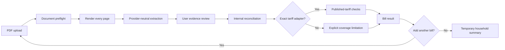

# WattProof Provider-Neutral Multi-Utility Design

**Status:** Approved design

**Date:** 2026-07-21

**Branch:** `codex/provider-neutral-multi-utility`

**Baseline:** `3438e946db28d27c5d3d19bbb4b7f8501c03d396`

## Executive summary

WattProof currently audits one PG&E/3CE electricity-bill shape against one archived
tariff bundle. This design broadens it into a provider-neutral utility statement
checker without pretending to possess a nationwide tariff database.

Every readable residential utility bill can receive evidence extraction and internal
arithmetic reconciliation when the deployment has a configured document reader; the
keyless public demo remains limited to deterministic known fixtures. Exact
published-tariff verification is an additional, opt-in capability supplied by narrowly
scoped adapters. The initial expansion covers electricity, natural gas, water,
wastewater, stormwater, and sanitation using three public sample documents as
adversarial fixtures. Existing PG&E/3CE behavior remains a regression contract.

Users audit bills sequentially and may collect completed results into a temporary
household bundle. The bundle exists only in the current browser page, contains no
account identity, and is cleared on refresh or close. No account system or database is
introduced.

## Why this direction

Three approaches were considered:

1. Add Duke-specific fields to the existing PG&E schema. This is the smallest patch,
   but would deepen the provider-specific model and immediately fail for gas and water.
2. Introduce a provider-neutral core with exact tariff adapters. This preserves the
   defensible PG&E verification while supporting useful checks for any readable bill.
3. Build a nationwide tariff database now. This would imply coverage and provenance
   that the project cannot yet substantiate, especially across gas and municipal water.

Approach 2 is selected. Indiana documents are fixtures and edge cases, not the product's
geographic boundary.

## Goals

- Accept readable residential electricity, gas, water, wastewater, stormwater,
  sanitation, and mixed-service PDF statements.
- Treat the rendered document as the authoritative evidence surface.
- Recompute arithmetic from printed operands with deterministic `Decimal` code.
- Explain which checks use only the bill and which use independent published sources.
- Preserve exact PG&E/3CE results, citations, formulas, and synthetic-error behavior.
- Support a sequential, session-only household bundle without accounts or persistence.
- Produce a maintainer-ready branch with tests, provenance, and real desktop/mobile
  screenshots.

## Non-goals

- Claim nationwide tariff coverage.
- Treat all Duke Energy jurisdictions or schedules as equivalent.
- Call a value tariff-verified when only the bill itself provides the rate.
- Infer missing tax bases, tiers, units, schedules, or service periods.
- Calculate savings without the usage data required for a defensible comparison.
- Persist uploaded documents, extracted account identity, or household history.
- Send provider messages or merge changes without maintainer review.

## Evidence from the supplied documents

### Duke Energy Indiana electricity guide

Source document: `how-to-read-duke-energy-electric.pdf`

SHA-256: `b131c36a215762796e72f3d20986fbea7e64e2dd611081d8936f8442102c3e9a`

The three-page public guide contains native text and a complete illustrative
electricity statement. Its visible arithmetic includes:

- Meter usage: `138957 - 137956 = 1001 kWh`.
- Connection charge: `$13.70`.
- Energy tiers: `300 × $0.186556 = $55.97`,
  `700 × $0.135777 = $95.04`, and `1 × $0.123051 = $0.12`.
- Riders 60, 62, 65, 66, 67, 68, 70, 73, and 74: `$2.83` net.
- Current charges: `$167.66`; seven-percent tax: `$11.74`; total: `$179.40`.

The guide says its dates and charges are illustrative. It is therefore suitable for
extraction and internal-reconciliation tests, but not as independent tariff truth.
That distinction is material: the sample prints Rider 67 as a `$0.006040/kWh` credit,
while the IURC approved a `$0.013516/kWh` Rate RS credit effective September 2025.

References:

- <https://www.duke-energy.com/-/media/pdfs/bill-examples/260482-bill-tutorial-handout-res-dei.pdf>
- <https://www.in.gov/iurc/files/ord_UA_082025.pdf>

### CenterPoint Energy Indiana gas guide

Source document: `centerpoint-gas-sample.pdf`

SHA-256: `c0b7d9b0252226078b39d6760308506c28b388729906d3ac54db950b9f819262`

The rendered gas statement shows `108 CCF`, a `1.03960` conversion factor,
`112.277 therms`, `$96.03` distribution and service charges, `$27.51` gas cost,
`$8.65` tax, and a `$132.19` total.

Its page-two native text layer also contains a different, invisible combined
electric/gas example totaling `$134.69`. A text-only extraction path can therefore
produce confident but false facts. This document is the regression fixture for the
rule that rendered evidence outranks embedded text.

Reference:

- <https://www.centerpointenergy.com/en-us/CustomerService/Documents/bill-guides/240312-20-EIP-IN%20Gas-bill-guide.pdf>

### City of Bloomington water guide

Source document: `sample-water-in.pdf`

SHA-256: `a414c296e3dd71a08aa459bb1a7c38fcdeab0c90aa0bb05f7c4e39ae9d70b79c`

The explanatory wrapper has native text, but the actual statement is a large raster
image. A native-text length threshold incorrectly classifies this file as fully
readable while omitting the bill values. The rendered statement shows:

- Water usage: `2 kgal × $3.73 = $7.46`.
- Water service: `$7.86`; fire protection: `$2.93`; sales tax: `$1.28`.
- Wastewater usage: `2 kgal × $7.76 = $15.52`; service: `$7.95`.
- Stormwater: `$2.70`; sanitation: `$6.22`; total: `$51.92`.

Reference:

- <https://bloomington.in.gov/sites/default/files/2026-02/Understanding%20Your%20Water%20Bill%202026%20Accessible.pdf>

## Product trust model

WattProof reports three cumulative verification levels:

1. **Evidence extracted** — every material value has visible rendered-page support.
2. **Internally reconciled** — deterministic code reproduces the bill's printed math.
3. **Tariff verified** — an exact adapter independently matches applicable published
   rates for the provider, jurisdiction, schedule, and service period.

The highest completed level is displayed prominently. Lower levels remain inspectable.
An unsupported provider is not an error: it can still reach internal reconciliation.
An unavailable tariff adapter never silently changes into a tariff claim.

Each audit line has:

- `status`: `verified`, `discrepancy`, `cannot_verify`, or `needs_review`.
- `scope`: `printed_math`, `statement_reconciliation`, or `published_tariff`.
- A formula, inputs, expected output, printed output, delta, rounding rule, and evidence.
- Optional dependency information so a root discrepancy is not counted again through
  downstream subtotals.

## Architecture

The principal units are:

- A rendered-document reader and preflight boundary.
- A provider-neutral statement schema.
- A deterministic internal-reconciliation engine.
- A registry of exact tariff adapters.
- The existing PG&E/3CE logic behind a compatibility adapter.
- A browser-memory household bundle and provider-specific next steps.

## Provider-neutral data contract

The new internal schema is version `2.0`. Existing PG&E `BillExtraction` fixtures remain
accepted through a compatibility translator and continue to serve as regression input.

### Utility document

A `UtilityDocument` contains:

- Schema version, document digest, page count, and extraction mode.
- Bill date, statement currency, statement totals, and their evidence.
- One or more `ServiceSection` objects.
- Document warnings and unresolved conflicts.

It does not require provider-specific PG&E or CCA fields.

### Service section

A service section contains:

- Stable ID and service type: `electricity`, `natural_gas`, `water`, `wastewater`,
  `stormwater`, `sanitation`, or `other`.
- Provider as printed, optional normalized legal provider, jurisdiction, and schedule.
- Service dates, meter identifiers/readings when present, and measurements.
- Printed charge lines and section subtotal.
- Page evidence for each material fact.

A document can contain multiple providers or multiple sections of the same service
type. PG&E delivery and 3CE generation can therefore remain distinct without making
the generic schema CCA-specific.

### Measurements, rates, money, and evidence

- Measurements store a `Decimal` value and explicit unit such as `kWh`, `CCF`,
  `therm`, or `kgal`.
- Rates store a `Decimal` value, currency or percentage basis, and denominator.
- Money stores a `Decimal` amount and ISO currency code.
- Evidence stores a one-based page number, shortest visible excerpt, and rendered-page
  provenance. A bounding region is optional and may only be stored when the reader
  actually supplies one.
- Facts separately carry `printed`, `inferred`, or `user_corrected` status. An inferred
  fact still identifies its visible supporting evidence and the normalization reason.
- User corrections preserve the original extracted value and evidence and add a
  `user_corrected` value; they do not overwrite provenance.

Validators reject impossible date ranges, duplicate IDs, incompatible units,
conflicting totals, native-only evidence, and component relationships that cannot be
made consistent.

## Document processing and extraction

### Preflight

Before extraction, WattProof validates the PDF signature, 10 MB size limit, 20-page
limit, page count, renderability, and bounded page dimensions. Malformed or encrypted
documents fail with an actionable message. Poppler subprocesses run without a shell
and with timeouts.

Every accepted page is rendered. Native PDF text is classified as a hint from a
native, mixed, or image-heavy document; text length alone never establishes bill
readability.

### Known public fixtures

Known fixture hashes use deterministic local structured data. This keeps the public
demo keyless and makes the adversarial documents reproducible. Fixture values still
carry page evidence and pass the same schema and reconciliation engine as uploaded
unknown documents.

Raw third-party PDFs should only be added to the repository when redistribution is
appropriate. Otherwise, retain normalized golden data, source URL and digest, and use
an independently created minimal regression document for hidden-text behavior.

### Unknown documents

When an operator configures an OpenAI API key, the extraction request includes rendered
page images plus separately labeled `UNTRUSTED_NATIVE_TEXT_HINT` content. GPT-5.6 maps
visible facts into the strict Pydantic schema but does not calculate, repair, or invent
values. Responses use structured output and `store=False`.

Every extracted material fact must identify rendered-page evidence. A value appearing
only in native text is excluded. Conflicting rendered and native values become a
review warning, not an automatic selection.

The public deployment without an API key continues to support only deterministic known
fixtures and explains that limitation directly.

References:

- <https://developers.openai.com/api/docs/guides/file-inputs>
- <https://developers.openai.com/api/docs/guides/structured-outputs>

## Internal reconciliation

The generic engine executes declared rule objects with `Decimal` values. Initial rule
types are:

- Meter or counter difference.
- Component sum.
- Quantity multiplied by a printed unit rate.
- Explicit percentage applied to an explicitly identified base.
- Printed conversion factor between compatible measurements.
- Tier sum and statement roll-forward.

The engine never invents an absent operand. If a tax percentage is printed but its base
cannot be identified, the tax remains `cannot_verify`. A printed rate may support an
internal product check, but it is not independent tariff evidence.

Every rule declares where rounding occurs and its comparison tolerance. Money rounds
half-up only at the bill's printed calculation boundary; unrounded intermediate values
remain available in the trace.

The Duke fixture exercises tier and rider arithmetic. The CenterPoint fixture exercises
CCF-to-therm conversion and visible-statement rollup. The Bloomington fixture exercises
multiple service sections and a cross-section statement total.

## Tariff adapters

An adapter declares:

- Normalized legal provider and accepted printed aliases.
- Jurisdiction and supported schedules or service classes.
- Inclusive effective periods.
- Supported rule set and required bill facts.
- Archived source citations and content digests.

Matching is exact and fail-closed. Provider family names such as “Duke Energy” are not
sufficient because rates differ across operating companies and jurisdictions. A
service period outside the adapter's archived coverage yields a published-tariff
`cannot_verify` result while preserving internal checks.

The existing PG&E/3CE bundle becomes the first adapter. Its verdicts, formulas,
citations, effective-period boundaries, plan-comparison limitation, and labeled `$5`
synthetic discrepancy must remain byte-for-byte or semantically equivalent where the
schema wrapper changes.

The supplied Duke guide does not enable a Duke tariff adapter. A future Duke Energy
Indiana Rate RS adapter may be enabled only after every supported base charge, tier,
rider, tax rule, and effective period is backed by archived regulator or utility source
material and tested against a non-illustrative statement.

## User journey

The current five steps become:

1. **Upload** — start with one utility PDF or a public sample.
2. **Review** — inspect rendered pages beside editable extracted facts.
3. **Verify** — view the bill result and verification level.
4. **Household** — review one or more completed bill summaries.
5. **Next steps** — inspect limitations or prepare provider-specific review requests.

After a result, the user chooses **Add another bill** or **Finish household review**.
Adding another bill returns to Upload and retains completed summaries in the current
JavaScript page state. The current raw file, blob URL, and preview are released when the
bill is completed or discarded.

The in-memory bundle retains only provider display name, service type, billing period,
currency, printed amount, consumption summary, verification level, root discrepancy,
and grounded audit results. It excludes names, addresses, account numbers, and meter
identifiers. Refreshing, closing, or choosing **Start over** clears it.

### Result presentation

- A plain-language verdict and highest verification-level badge appear first.
- Service sections remain distinct, including water, wastewater, stormwater, and
  sanitation on the same statement.
- High-priority findings appear before the expandable calculation ledger.
- Desktop may use a table; mobile uses stacked calculation cards rather than a squeezed
  horizontal table.
- Status never relies on color alone.
- Plan comparison is optional content for supported electricity cases, not a universal
  workflow step.

### Household presentation

The Household screen shows a card per bill with provider, service dates, service types,
printed amount, usage, verification level, and issue count. It may show a combined
printed amount only for compatible currencies and clearly overlapping reporting
periods. It does not label discrepancies as savings.

Review-request drafts remain separate by provider and are grounded only in root audit
lines. If a bill is merely internally reconciled, the next step explains what source
coverage is missing rather than implying provider error. WattProof never sends a
message automatically.

## Error handling

- Missing upload, invalid PDF, oversize document, excessive pages, render failure, and
  extraction unavailability produce distinct actionable errors.
- Missing or conflicting facts return the user to Review with affected fields marked.
- Unsupported providers continue into internal reconciliation.
- Missing or ambiguous adapter matches downgrade published-tariff coverage instead of
  failing the bill.
- Rendered/native-text conflicts are visible review warnings.
- User-facing errors omit stack traces, API internals, document text, and secret values.
- A failure on a newly added bill does not delete already completed bundle summaries.

## Privacy and security

- Uploads use temporary files that are closed and deleted immediately after processing.
- Raw documents, page images, extracted PII, and model inputs are not written to
  application logs.
- Operational logs may include request ID, byte size, page count, document class,
  duration, and outcome, but not the document digest or bill contents.
- Model extraction is opt-in through operator configuration, disclosed in the UI, and
  uses `store=False`.
- Browser bundle state is memory-only and contains no account identity.
- Screenshots use public sample documents and contain no personal information.
- Existing upload limits remain, with explicit render timeouts and dimension limits.

## Testing strategy

Development follows outside-in behavior tests, then focused model and calculation
tests.

### Required regression coverage

- Existing authentic PG&E extraction and audit golden files remain green.
- The labeled synthetic fixture still identifies exactly `$5.00` at the root line.
- PG&E/3CE citations and source hashes still verify.
- Legacy `BillExtraction` input translates without changing user-visible conclusions.

### New document fixtures

- Duke: assert `1001 kWh`, every tier and rider product, `$167.66` current charges,
  `$11.74` tax, and `$179.40` total; highest level is internal reconciliation.
- CenterPoint: assert only the visible `112.277 therms` and `$132.19` gas statement.
  Explicitly assert that hidden `534 kWh`, `6.326 therm`, and `$134.69` values are absent.
- Bloomington: assert every visible water, wastewater, stormwater, and sanitation
  charge line and the `$51.92` total despite the statement being raster content inside
  a text-bearing wrapper.

### Model and engine coverage

- Multiple service sections and providers.
- Unit compatibility and conversions.
- Duplicate IDs, impossible dates, missing evidence, conflicting values, and
  user-correction provenance.
- Half-up money rounding, tier boundaries, percentages, subtotals, roll-forwards, and
  root-discrepancy deduplication.
- Exact adapter aliases, schedules, jurisdictions, effective-period boundaries, source
  integrity, and unsupported fallbacks.

### Web and acceptance coverage

- Flask API validation and useful error responses.
- Sequential add-another behavior and retention after a later-bill error.
- Explicit clearing on Start over and browser reload.
- Separate provider letters and grounded amounts.
- Keyboard operation, focus movement, field labels, screen-reader status text, and
  non-color-only indicators.
- Desktop and mobile browser verification on the actual running app.

## Screenshot deliverables

The branch will commit real application captures, not generated mockups:

- `docs/screenshots/multi-utility-upload-desktop.png`
- `docs/screenshots/pge-tariff-verified-desktop.png`
- `docs/screenshots/duke-internal-reconciliation-desktop.png`
- `docs/screenshots/centerpoint-gas-desktop.png`
- `docs/screenshots/household-bundle-desktop.png`
- `docs/screenshots/water-review-mobile.png`
- `docs/screenshots/household-result-mobile.png`

Desktop captures use a documented fixed viewport; mobile captures use `390 × 844`.
`docs/screenshots/README.md` records the commit, viewport, sample, navigation steps, and
capture command or procedure for each image.

## Release and maintainer handoff

All work remains on `codex/provider-neutral-multi-utility`. No commit is made on `main`,
and no merge is performed. The existing deployment guard remains unchanged: production
deployment is eligible only for a push to `refs/heads/main` after verification.

The handoff contains:

- The approved design and an implementation plan.
- Focused implementation commits.
- `make verify` results and any browser-acceptance results.
- Fixture provenance, hashes, and known limitations.
- Real desktop/mobile screenshots and reproduction instructions.
- A maintainer-oriented summary suitable for a draft pull request.

If an authenticated user fork is available, the completed branch may be pushed there
and offered as a draft pull request to `3clyp50/WattProof`. The assistant does not push
to upstream `main`, merge, or deploy.

## Acceptance criteria

The contribution is ready for maintainer review when:

1. PG&E/3CE behavior and all existing verification guarantees remain green.
2. The three supplied document shapes reach accurate evidence extraction and internal
   reconciliation with the expected visible values.
3. CenterPoint's invisible conflicting text cannot enter the audited statement.
4. The Duke illustrative sample never displays a tariff-verified badge.
5. A user can audit electric, gas, and water/sanitation bills sequentially and view a
   session-only household summary.
6. Product copy and the provider-neutral core do not imply Indiana-only coverage.
7. Unsupported tariff coverage is explicit and does not block internal checks.
8. Committed screenshots show the real desktop/mobile app without personal data.
9. Verification passes on supported Python versions, and the branch does not trigger a
   production deployment.
10. The maintainer can review the complete change without any modification to `main`.

## Known limitations after this increment

- Exact published-tariff coverage remains limited to adapters with archived sources;
  the initial adapter remains PG&E/3CE.
- Unknown-document extraction requires an operator-configured OpenAI key.
- The public keyless demo recognizes only known deterministic fixtures.
- The bundle is intentionally temporary and cannot be restored after page reload.
- Plan comparison remains unavailable without appropriate interval or historical usage
  data.
- Municipal tax rules and provider-specific tariff semantics are not generalized from
  one sample bill.
